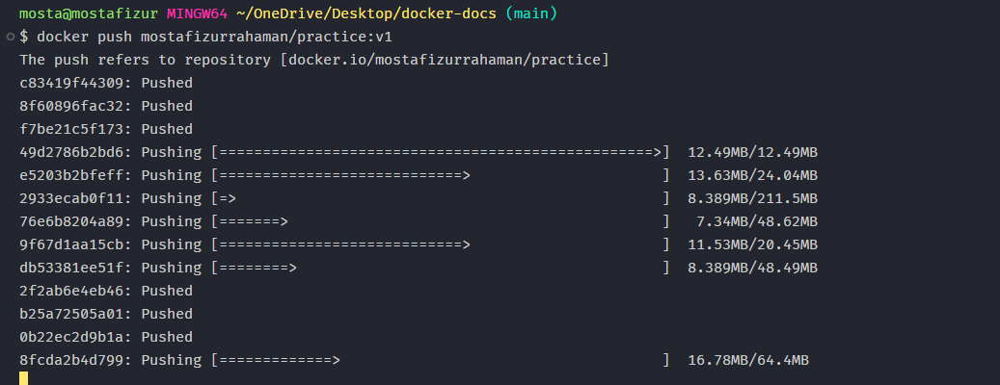

# Docker installation Guide in Windows:

## ➡️ 1. Prepare windows for installation:

- Search `Turn on windows features` on windows search box:
- Enable: `Virtual Mechine platform` & `Windows Sub system for linux`
- Save and wait for update

## Docker Tools:

-  1. Docker Engine
-  2. Docker Desktop
-  3. Docker Hub
-  4. Docker Compose

# SETUP DOCKER IN A PROJECT:

- Create a docker file without any extension:
- Filename = `Dockerfile`

```Dockerfile

      FROM image:tag

      WORKDIR /app

      COPY package.json

      RUN npm install

      COPY . .

      EXPOSE 5000

      CMD ["npm", "run", "dev"]
```

## What is docker image ?

- Docker image is a file or template, which contains code, runtime, environment
  variables and configuration files to run the application.
- Images are immutable (Read only)
- Create multliple container by using an docker image.
- আপনি যদি একটি কম্পিউটার গেমের কথা চিন্তা করেন, তবে ডকার ইমেজ হলো সেই গেমের
  ইন্সটলেশন ফাইল বা ISO ফাইল। এটি নিজে নিজে চলতে পারে না, কিন্তু এটি ব্যবহার করে
  গেমটি ইন্সটল বা রান করা যায়।

## What is container:

- A docker container is a running instance of image.
- A container has been created after running an image.
- Containers are immutable (Writable)
- Without an image you cannot create a container

Here are concise notes on the differences between **Docker Images** and **Docker
Containers**, structured specifically for quick reading and study.

---

## **Quick Comparison: Image vs. Container**

| Feature        | Docker Image                                                                   | Docker Container                                            |
| :------------- | :----------------------------------------------------------------------------- | :---------------------------------------------------------- |
| **Definition** | A static, read-only template containing the application code and dependencies. | A live, functional instance of an image.                    |
| **State**      | **Inactive** (Stored on disk).                                                 | **Active** (Running in memory/RAM).                         |
| **Mutability** | **Immutable** (Cannot be changed once built).                                  | **Mutable** (Has a thin writable layer for temporary data). |
| **Analogy**    | The **Blueprint** or the **Recipe**.                                           | The **Building** or the **Finished Dish**.                  |
| **Storage**    | Occupies disk space.                                                           | Occupies CPU, RAM, and disk space.                          |

---

---

## Docker images command:

1. Build Image : `docker build .`
2. Build image with tag: `docker build -t imageName:version . `
3. Images list : `docker images -a`
4. Running Images: `docker images`
5. Remove Docker Image: `docker rmi imageID`
6. Remove all unused Images: `docker images prune`

---

---

## Docker Container commands:

1. List of all containers: `docker ps -a`
2. Running Containers list: `docker ps`
3. Run a container from Image:
   `docker run  -p devicePort:dockerPort imageName:tagName`

```bash
docker run -p 5000:5000 imageID
```

4. Start a container: `docker container start containerID` and
   `docker start containerID`
5. Stop Container: `docker stop containerID` and
   `docker container stop containerID`
6. Start a container with interactivity: `docker run -it imageName:tagName`
7. Remove a container: `docker rm containerID`
8. Remove all stopped container: `docker container prune`

---

---

## Run a docker container with Attach `-a` or `--attach`

1. To run a docker container with attached terminal you can use this.
2. To Run existing docker container:

```bash
   docker start containerName -a

   docker start containerName --attach
```

3. To Attach already running docker for interactive app:

```bash
   docker attach containerName
```

---

---

## Detach an container :

1. To Remove terminal logs or interactivity :
2. While running first time

```bash
   docker run -p 5000:5000  --name containerName -d imageName

   docker run -p 5000:5000 --name containerName  --detach imageName
```

---

---

# Docker Hub :

## Login to your docker hub account:

-  1. visit: `https://hub.docker.com/`
-  2. create a repository. public or private
-  3. my example repository: `mostafizurrahaman/practice`. The repo name is
      practice and `mostafizurrahaman` is my user name.

## Go to you project directory (Local mechaine):

1. Login into your same docker account. Run this command:

```bash
docker login
```

## Push to Docker Hub Repo:

1. Build an image which should matched with your created repository of docker
   hub:

```bash
docker build -t  mostafizurrahaman/practice:v1 .
```

2. Note: If `dockerHubRepoName` !== `LocalImageName` push and pull will not
   work.

3. Now run this command to push:

```bash
 docker push username/repoName:tag

 docker push mostafizurrahaman/practice:v1
```



4. Note: If you push without any tag. The `default` tag will be latest.

## Pull from Docker hub to local machine:

1. use: `docker pull userName/repoName:tagName` for pull

```bash
 docker mostafizurrahaman/practice:v1

```

2. After running this from dockerhub a image will be added or updated into your
   local docker hub.

## Best practices:

1. If you working with a team before running a container you can pull from
   docker hub first for latest image.
2. Then you can run the image:

```bash
docker run -p 5000:5000 -name newContainer --rm mostafizurrahaman/practice:v1
```

3. After running this command if the `image` is avaiable in local it will use
   the local one nor it will fetch from dockerhub.

4. So always pull first then build the image.

---
